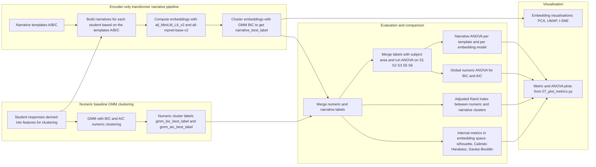

# LLM Narrative Clustering Pipeline

```mermaid
flowchart LR
  subgraph N["Numeric baseline GMM clustering"]
    N1["Student responses derived into features for clustering"]
    N2["GMM with BIC and AIC numeric clustering"]
    N3["Numeric cluster labels gmm_bic_best_label and gmm_aic_best_label"]
  end

  subgraph L["Encoder-only transformer narrative pipeline"]
    L1["Narrative templates A/B/C"]
    L2["Build narratives for each student based on the templates A/B/C"]
    L3["Compute embeddings with all_MiniLM_L6_v2 and all-mpnet-base-v2"]
    L4["Cluster embeddings with GMM BIC to get narrative_best_label"]
  end

  subgraph E["Evaluation and comparison"]
    E1["Merge numeric and narrative labels"]
    E2["Internal metrics in embedding space: silhouette, Calinski-Harabasz, Davies-Bouldin"]
    E3["Adjusted Rand Index between numeric and narrative clusters"]
    E4["Merge labels with subject area and run ANOVA on S1 S2 S3 S5 S6"]
    E4a["Global numeric ANOVA for BIC and AIC"]
    E4b["Narrative ANOVA per template and per embedding model"]
  end

  subgraph V["Visualisation"]
    V1["Embedding visualisations: PCA, UMAP, t-SNE"]
    P1["Metric and ANOVA plots from 07_plot_metrics.py"]
  end

  N1 --> N2
  N2 --> N3
  N1 --> L2
  L1 --> L2 --> L3 --> L4
  N3 --> E1
  L4 --> E1
  E1 --> E2
  E1 --> E3
  E1 --> E4
  E4 --> E4a
  E4 --> E4b
  L4 --> V1
  E2 --> P1
  E3 --> P1
  E4a --> P1
  E4b --> P1
```
